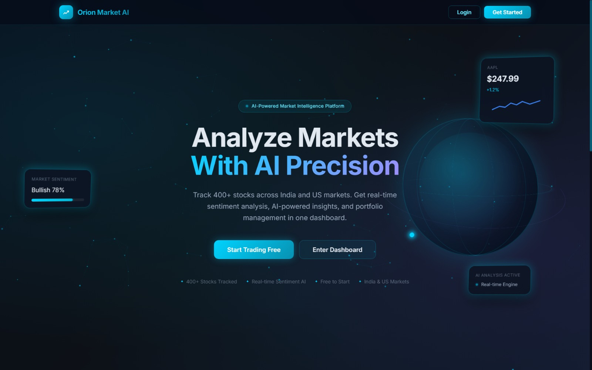
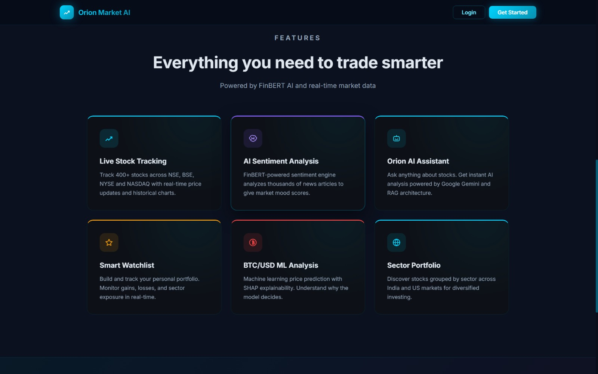
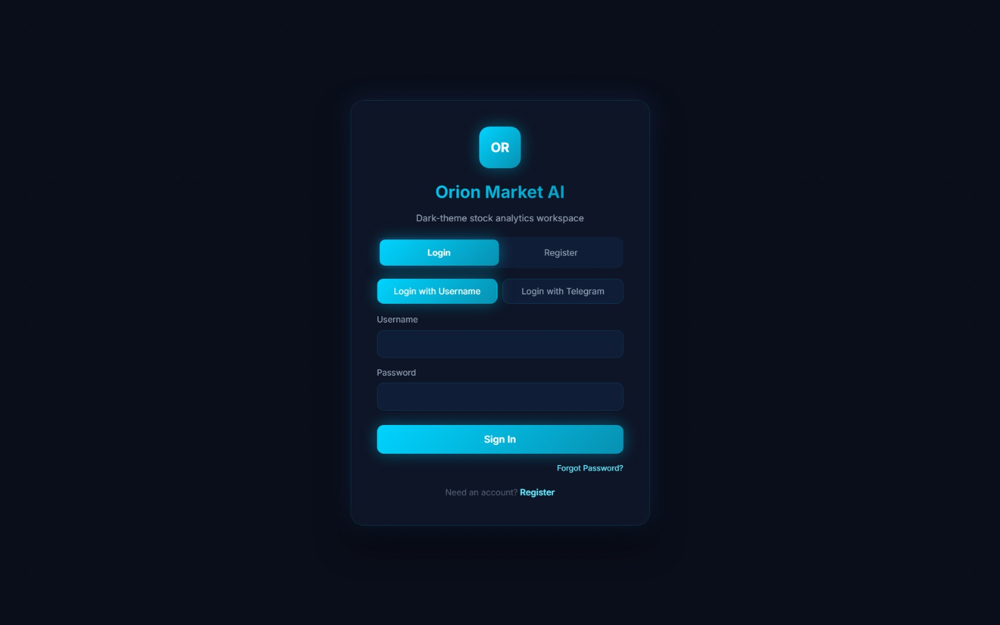
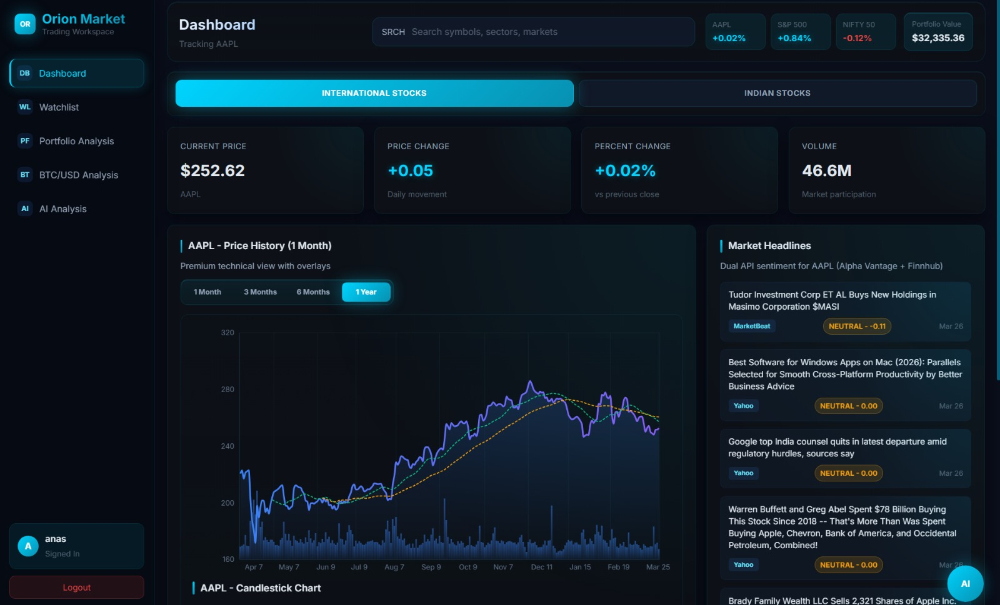
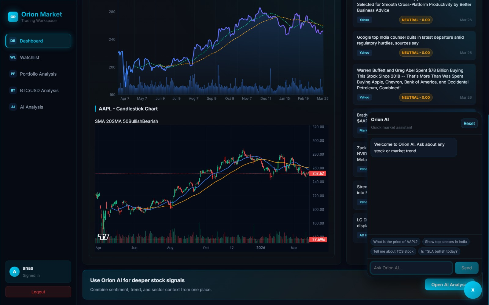
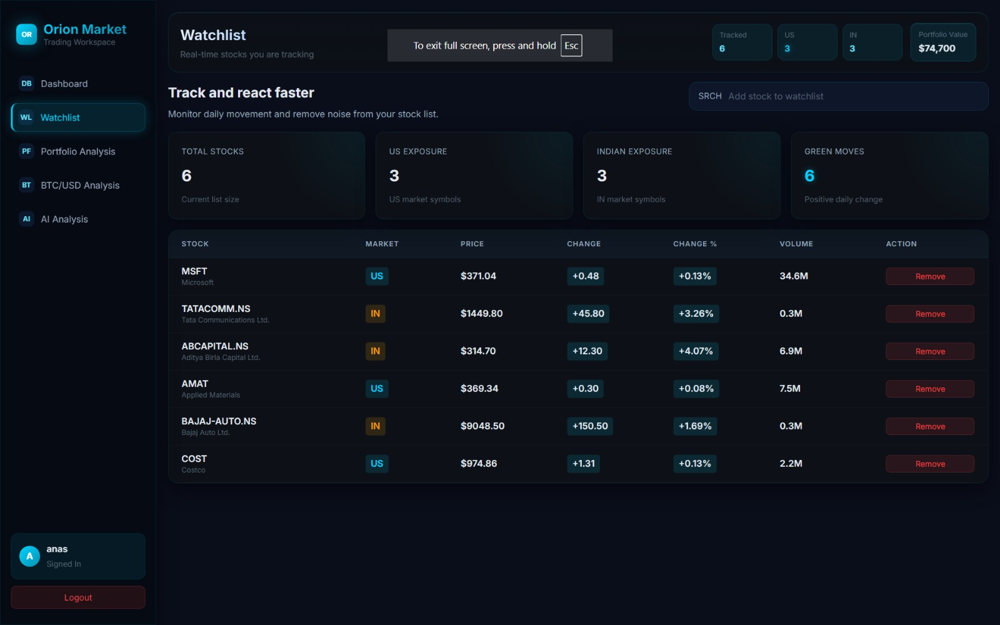
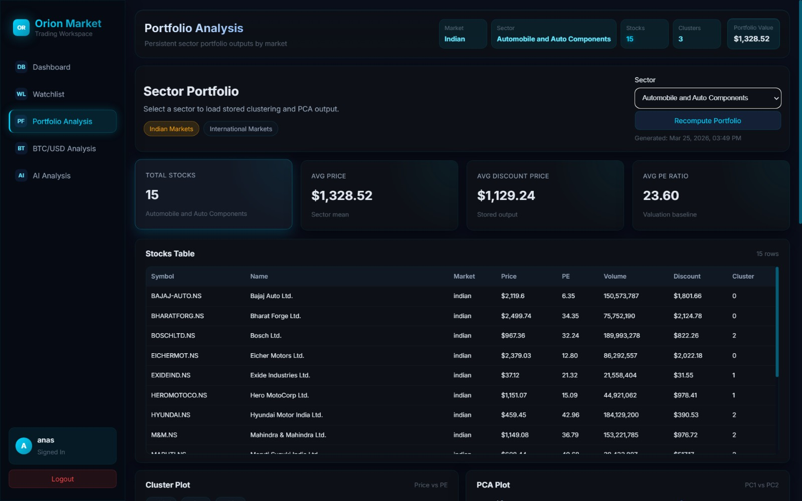
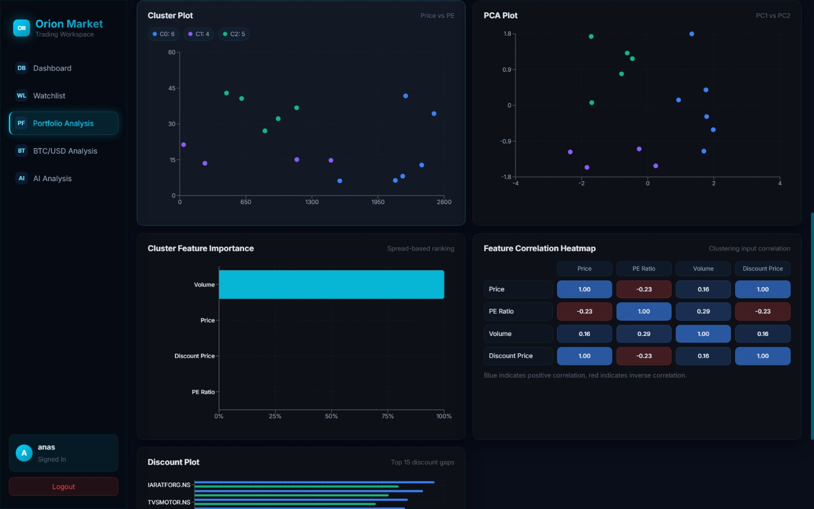
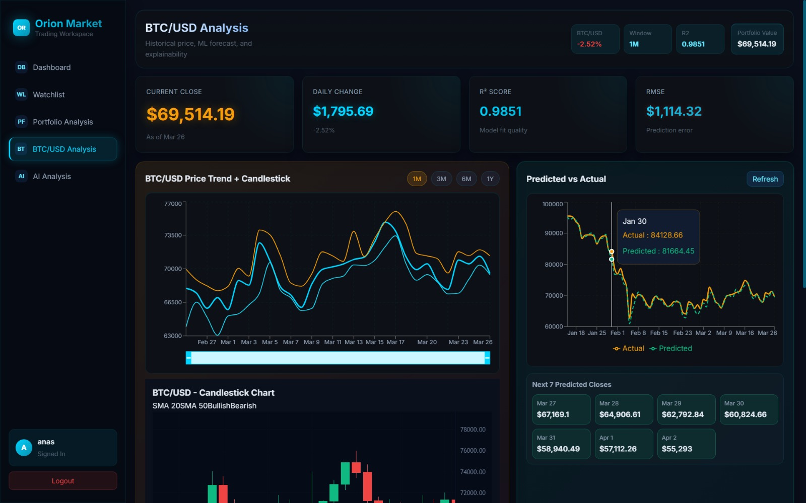
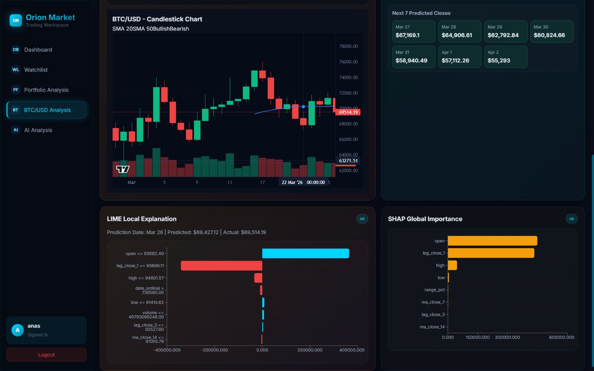

<div align="center">


<br/>

[](https://oriona.duckdns.org)
[](https://python.org)
[](https://djangoproject.com)
[](https://react.dev)
[](https://azure.microsoft.com)

<br/>

> **Track 400+ stocks across India & US markets** with real-time sentiment analysis, ML price prediction, portfolio clustering, and an AI-powered chatbot — all in one dark-theme trading workspace.

<br/>

</div>

---

## 🔐 Demo Access

Try the live platform instantly — no setup required:

| Field    | Value         |
|----------|---------------|
| 🌐 URL   | [https://oriona.duckdns.org](https://oriona.duckdns.org) |
| 👤 Username | `anas`     |
| 🔑 Password | `admin1234` |

---

## 📸 Screenshots

### 🏠 Landing Page



### 🔑 Login Page


### 📊 Dashboard



### 👁️ Watchlist


### 📁 Portfolio Analysis



### ₿ BTC/USD Analysis




---

## ✨ Features

<table>
<tr>
<td width="50%">

**📈 Live Stock Tracking**
Track 400+ stocks across NSE, BSE, NYSE & NASDAQ with real-time price updates and interactive candlestick charts.

**🧠 AI Sentiment Analysis**
FinBERT-powered sentiment engine analyzes thousands of news articles, producing market mood scores with dual-API coverage (Alpha Vantage + Finnhub).

**🤖 Orion AI Chatbot**
Ask anything about stocks — powered by LLaMA 3.1 via Groq with a full RAG architecture backed by ChromaDB vector search.

**⭐ Smart Watchlist**
Build and monitor your personal portfolio with real-time gains, losses, and sector exposure tracking.

</td>
<td width="50%">

**₿ BTC/USD ML Analysis**
Machine learning price prediction using Linear Regression & ARIMA, with SHAP and LIME explainability overlays.

**🌐 Sector Portfolio**
Stocks intelligently grouped by sector across Indian & US markets for diversified investing insights.

**📊 K-Means Clustering**
Portfolio stocks clustered by Price, PE Ratio & Volume with PCA visualization for correlation discovery.

**📰 Real-Time News**
Live market headlines with sentiment scores powered by dual-API integration for maximum coverage.

</td>
</tr>
</table>

---

## 🛠️ Tech Stack

### 🎨 Frontend


### ⚙️ Backend


### 🤖 AI / ML


| Model / Library | Purpose |
|---|---|
| FinBERT | News sentiment analysis |
| LLaMA 3.1 (Groq) | AI chatbot responses |
| ChromaDB | Vector database for RAG |
| SHAP + LIME | ML model explainability |
| K-Means + PCA | Portfolio clustering |
| ARIMA | BTC time-series forecasting |
| Sentence Transformers | Embedding generation |

### 📡 APIs & Data Sources
| API | Usage |
|---|---|
| yFinance | Stock price data (400+ tickers) |
| Finnhub | Real-time news & sentiment |
| Alpha Vantage | Market data & sentiment |
| NewsAPI | Aggregated headlines |
| Groq | LLaMA 3.1 inference |
| Google Gemini | Supplementary AI analysis |

### ☁️ Infrastructure


---

## 🏗️ Architecture

### Project Structure

```
Orion-Market-AI/
├── backend/
│   ├── orion_backend/        # Django settings & URLs
│   ├── authentication/       # JWT auth + Telegram OTP
│   ├── stocks/               # Stock models & API views
│   ├── news/                 # News data models
│   ├── sentiment/            # Sentiment result models
│   ├── chatbot/              # Chatbot Django app
│   ├── portfolio/            # Portfolio management
│   ├── services/
│   │   ├── api_clients/      # Finnhub, Alpha Vantage, yFinance
│   │   ├── data_processing/  # Medallion Architecture Pipeline
│   │   └── ml/
│   │       ├── chatbot/      # RAG Engine + Groq AI Engine
│   │       ├── sentiment/    # FinBERT Service
│   │       ├── clustering/   # K-Means Portfolio Clustering
│   │       └── btc_analysis/ # BTC ML Pipeline (SHAP/LIME)
│   ├── chroma_db/            # ChromaDB Vector Database
│   └── data/                 # Stock & market data
├── frontend/
│   ├── src/
│   │   ├── pages/            # Dashboard, Watchlist, Portfolio, BTC, Chatbot
│   │   └── components/       # Reusable UI components
│   └── build/                # Production build (served by Nginx)
├── docs/
│   └── screenshots/          # README screenshots (.jpeg)
└── scripts/                  # Deployment & automation scripts
```

### 🏅 Medallion Data Pipeline

```
┌─────────────────────────────────────────────────────────────┐
│                   MEDALLION ARCHITECTURE                     │
├───────────────┬──────────────────┬──────────────────────────┤
│  📥 BRONZE    │   🔄 SILVER      │      🥇 GOLD             │
│               │                  │                          │
│ Raw News API  │ Cleaned &        │ ChromaDB Embeddings      │
│ Raw Prices    │ Deduplicated     │ Vector Search Ready      │
│ Raw Sentiment │ FinBERT Scored   │ RAG Context for Chatbot  │
│               │ Normalized       │ Dashboard-Ready Data     │
└───────────────┴──────────────────┴──────────────────────────┘
```

### 🌐 Production Routing

```
https://oriona.duckdns.org          →  React Frontend (Nginx)
https://oriona.duckdns.org/api/     →  Django REST API (Gunicorn)
https://oriona.duckdns.org/ws/      →  WebSocket (Real-time updates)
```

---

## 👥 Team

### 🎨 Anas Jahagirdar — [`feature-anas`](https://github.com/anasjahagirdar/Orion-Market-AI/tree/feature-anas)

| Area | Contribution |
|---|---|
| 🎨 UI/UX | Complete dark-theme design system across all pages |
| 📊 Charts | Candlestick charts, price history, trend overlays |
| 🏗️ Project Structure | Django project scaffolding and app organization |
| 💾 Stock Loading | Loaded 400+ stocks into database (India + US markets) |
| ₿ BTC/USD | Linear Regression + ARIMA model implementation |
| 🧠 Sentiment | FinBERT sentiment analysis integration |
| 📱 Auth | Telegram OTP login implementation |
| 🔐 Bug Fixes | Fixed 401 auth errors and stock card loading states |

**Key Commits:**
```
0b111df  feat(anas): UI/UX upgrade + fix login 401 + fix stocks loading
d8f0981  Upgraded UI/UX, Fix stock card loading and error states
954b319  Telegram OTP added, Charts added
1906338  UI upgrade: stock dropdown, candlestick chart, sentiment
894b1ac  chore: add .gitignore and .env.example
```

---

### 🧑‍💻 Taqi Sayyed — [`feature-taqi`](https://github.com/anasjahagirdar/Orion-Market-AI/tree/feature-taqi)

| Area | Contribution |
|---|---|
| ☁️ Infrastructure | Azure VM creation, configuration, and full deployment |
| 🔒 HTTPS/SSL | Nginx + Certbot + DuckDNS domain setup |
| 🗄️ Database | SQLite → PostgreSQL migration |
| 🧬 Vector DB | ChromaDB setup, stock & news data vectorization |
| 🤖 Chatbot | RAG pipeline training and ChromaDB integration |
| 📊 Portfolio | Sector-based portfolio analysis (India & International) |
| 🔵 Clustering | K-Means clustering + PCA visualization |

**Key Commits:**
```
7655739  Fixed sector separation for Indian and International stocks
954b319  Added sector-based portfolio analysis
5aa9860  Merged feature-taqi with resolved conflicts
3a78eab  VM deployment infrastructure setup
```

---

## 📅 Git History

```
1d3e2e1  Anas        chore: ignore pyc, sqlite3, pm2 files
9b2b86a  Anas        Merge pull request #1 from anasjahagirdar/feature-anas
0b111df  Anas        feat(anas): UI/UX upgrade + fix login 401 + fix stocks loading
299c8dc  Anas        Add yfinance cache to gitignore
d8f0981  Anas        Upgraded the UI/UX, Fix stock card loading and error states
5aa9860  TAQISAYYED  Merged feature-taqi - resolved pycache conflicts
e893abe  TAQISAYYED  Merged feature-anas - resolved pycache conflicts
49d470b  TAQISAYYED  Remove all pycache files from git tracking
3a78eab  TAQISAYYED  Save current changes before merging
7655739  TAQISAYYED  Fixed sector separation for Indian and International stocks
954b319  Anas        Telegram OTP added, Charts added
1906338  Anas        UI upgrade: stock dropdown, candlestick chart, sentiment
894b1ac  Anas        chore: add .gitignore and .env.example
```

---

## 🚀 Local Setup

### Prerequisites

- Python 3.12+
- Node.js 18+
- Git

### 1. Clone the Repository

```bash
git clone https://github.com/anasjahagirdar/Orion-Market-AI.git
cd Orion-Market-AI
```

### 2. Backend Setup

```bash
cd backend
python3 -m venv venv
source venv/bin/activate        # Windows: venv\Scripts\activate
pip install -r ../requirements.txt
cp .env.example .env            # Fill in your API keys
python manage.py migrate
python manage.py runserver
```

Backend runs at: `http://localhost:8000`

### 3. Frontend Setup

```bash
cd ../frontend
npm install
npm start
```

Frontend runs at: `http://localhost:3001`

### 4. Environment Variables

Create a `.env` file in `/backend/` using `.env.example` as a template:

```env
# Django
SECRET_KEY=your-django-secret-key
DEBUG=True
ALLOWED_HOSTS=localhost,127.0.0.1

# AI Models
GROQ_API_KEY=your_groq_key
GEMINI_API_KEY=your_gemini_key
HUGGINGFACE_API_KEY=your_hf_key

# Market Data
FINNHUB_API_KEY=your_finnhub_key
ALPHA_VANTAGE_API_KEY=your_alpha_vantage_key
NEWS_API_KEY=your_newsapi_key

# Auth
TELEGRAM_BOT_TOKEN=your_telegram_bot_token
```

---

## ☁️ Production Deployment

Deployed on **Azure VM (Ubuntu 24.04)** with the following stack:

| Component | Role |
|---|---|
| Nginx | Reverse proxy for React + Django |
| Gunicorn | Python WSGI server (3 workers) |
| Certbot | SSL certificate (auto-renew) |
| DuckDNS | Free dynamic DNS (`oriona.duckdns.org`) |
| PostgreSQL | Production database |

---

## 📄 License

This project is built for **educational and research purposes**.

---

<div align="center">


*Built with ❤️ by [Anas Jahagirdar](https://github.com/anasjahagirdar) & [Taqi Sayyed](https://github.com/TAQISAYYED)*

</div>
